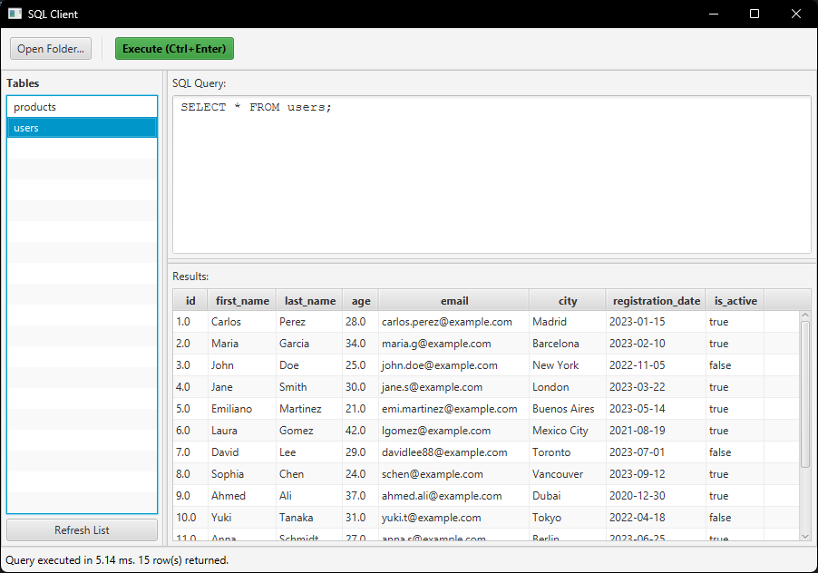
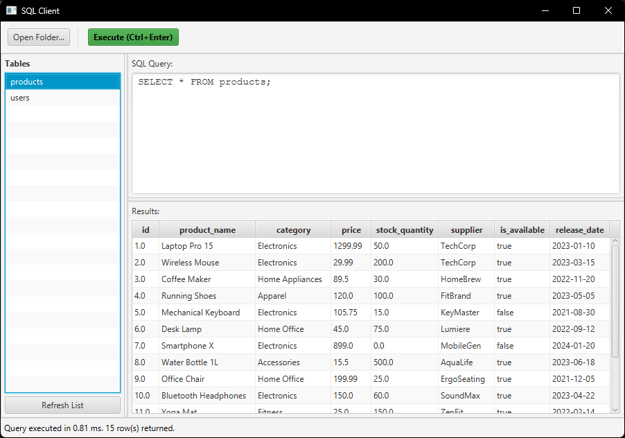
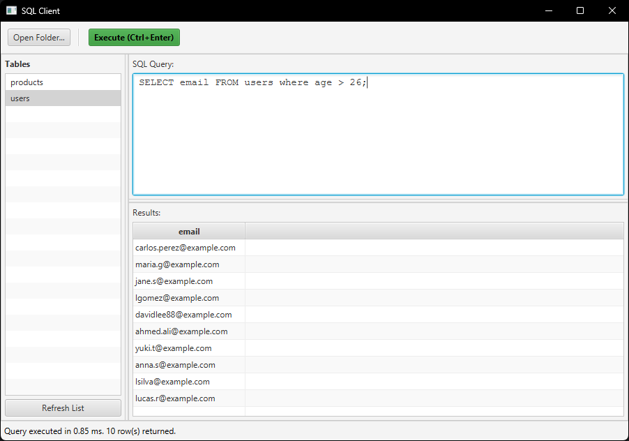
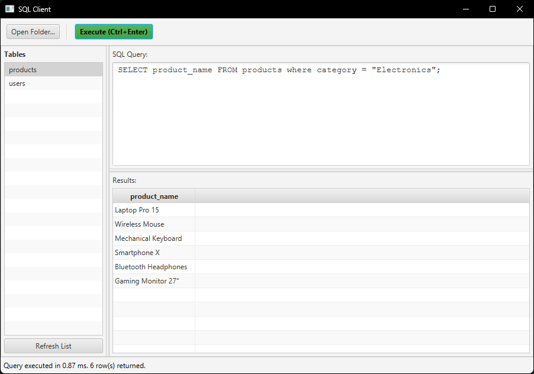

# SQL Engine & Compiler

Un motor de base de datos SQL ligero y educativo escrito en Java, capaz de compilar y ejecutar consultas SQL sobre archivos planos (CSV). Este proyecto demuestra la implementación completa de un compilador, desde el análisis léxico hasta la ejecución semántica mediante patrones de diseño.

---

## Galería del Proyecto

| Editor de Consultas y Resultados | Explorador de Tablas (CSV) |
|:---:|:---:|
|  |  |

| Análisis de Consultas Complejas | Feedback de Errores en Tiempo Real |
|:---:|:---:|
|  |  |

---

## Arquitectura del Sistema

El proyecto sigue una arquitectura modular y desacoplada para garantizar que el "motor" (core) pueda ser consumido por diferentes interfaces.

*   **`sql-core`**: El corazón del proyecto. Contiene la lógica del compilador, el árbol de sintaxis abstracta (AST) y el motor de ejecución. No tiene dependencias de UI.
*   **`sql-ui`**: Interfaz gráfica moderna construida con **JavaFX**. Ofrece un editor de código con resaltado y visualización de tablas de datos.
*   **`sql-cli`**: Interfaz de línea de comandos para usuarios avanzados que prefieren la terminal.
*   **`db/`**: Almacenamiento persistente basado en archivos **CSV**, actuando como las "tablas" de la base de datos.

---

## El Pipeline del Compilador (Algoritmo)

El proceso de transformación de una cadena de texto SQL a un conjunto de resultados sigue las fases clásicas de la teoría de compiladores:

### 1. Análisis Léxico (Scanner)
Utiliza una **Máquina de Estados Finitos (FSM)** para convertir el flujo de caracteres en `Tokens`. Reconoce palabras reservadas (`SELECT`, `FROM`, `WHERE`), identificadores, operadores lógicos y literales.

### 2. Análisis Sintáctico (Parser)
Implementa un algoritmo de **Descenso Recurso (Recursive Descent Parsing)**. Valida la gramática SQL y construye un **Árbol de Sintaxis Abstracta (AST)**.
*   **Soporte**: Consultas `SELECT *`, selección de columnas específicas, cláusulas `WHERE` con lógica booleana (`AND`, `OR`, `NOT`) y operadores de comparación.

### 3. Análisis Semántico y Ejecución (Visitor Pattern)
Se utiliza el **Patrón de Diseño Visitor** para recorrer el AST.
*   **Evaluador de Expresiones**: Procesa la lógica del `WHERE` fila por fila.
*   **Data Access**: Mapea identificadores de tablas a archivos físicos en el sistema, cargando y filtrando los datos de forma eficiente.

---

## Stack Tecnológico

*   **Lenguaje**: Java 17+
*   **Interfaz Gráfica**: JavaFX
*   **Gestión de Dependencias**: Maven
*   **Pruebas**: JUnit 5
*   **Persistencia**: Formato CSV (Flat File Database)

---

## Cómo Empezar

### Requisitos
*   JDK 17 o superior.
*   Maven.

### Ejecución
1.  Clona el repositorio.
2.  Compila el proyecto:
    ```bash
    mvn clean install
    ```
3.  Ejecuta la interfaz gráfica:
    ```bash
    mvn javafx:run -pl sql-ui
    ```

---

## Características Destacadas
*   **Arquitectura Modular**: Separación clara de responsabilidades.
*   **Implementación desde Cero**: Sin bibliotecas externas para el parsing o escaneo.
*   **Visualización Dinámica**: Generación automática de columnas en la UI basada en el resultado de la consulta.
*   **Patrones de Diseño**: Uso intensivo de *Visitor, Strategy y DAO*.

